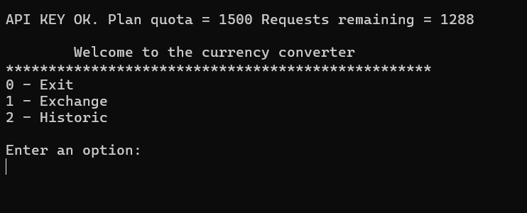
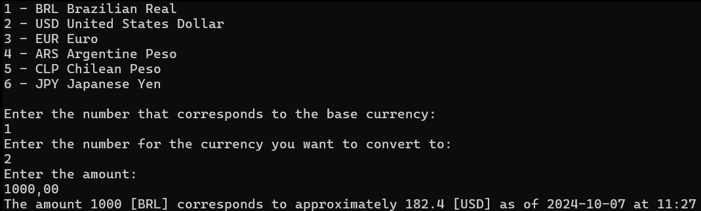

# 💲💰Currency Converter

Application (CLI) for real-time currency conversion
___

## Getting started
To run the project, you will need to install the following programs:
- [JDK 17: Required to run the Java project](https://www.oracle.com/java/technologies/downloads/?er=221886#java17)
- [Maven 3.9.9: Required to build the Java project](https://maven.apache.org/download.cgi)
- [Git: Required to clone the project (optional)](https://git-scm.com/downloads)

### Installing
Clone the repository
```
    git clone https://github.com/gabriellrocha/currency-converter.git
```
Or download the zip by clicking [here](https://github.com/gabriellrocha/currency-converter/archive/refs/heads/main.zip).
If you choose .zip, remember to unzip it.

### Build
Navigate to the root folder `.\currency-converter` and type in CMD:
```
mvn clean install 
```
### Execute
In the same directory run:

```
java -jar .\target\currency-converter.jar

```
Everything going as expected you will see the following message in the terminal




---
## Features
* Allows the user to enter the base currency, the target currency, and the value to obtain the current exchange rate.
The system should perform a real-time query to an external API that returns the conversion based on the provided information.



---
⌨️ with ❤️ by [Gabriel Rocha](https://github.com/gabriellrocha)
