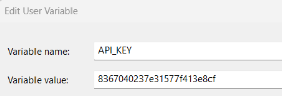
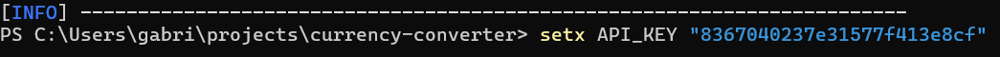

# 💲💰Currency Converter

Application (CLI) for real-time currency conversion
___

## Getting started
To run the project, you will need to install the following programs:
- [JDK 17: Required to run the Java project](https://www.oracle.com/java/technologies/downloads/?er=221886#java17)
- [Maven 3.9.9: Required to build the Java project](https://maven.apache.org/download.cgi)
- [Git: Required to clone the project (optional)](https://git-scm.com/downloads)

### Installing
Clone the repository
```
git clone https://github.com/gabriellrocha/currency-converter.git
```
Or download the zip by clicking [here](https://github.com/gabriellrocha/currency-converter/archive/refs/heads/main.zip).
If you choose .zip, remember to unzip it.

### Build
Navigate to the root folder `currency-converter` and type:
```
mvn clean install 
```
### Execute
```
⚠️IMPORTANT!
To be able to use this application you need to generate your API key. You can do this at https://www.exchangerate-api.com/
```

- If you have successfully run this application at least once, skip straight to step 2

***STEP 1***

### How to configure my API key

- Basically you can do this in two ways. Manually: via the system panel. The variable name must be API_KEY and the value obtained from the given link
</br></br>
- The second way is through your operating system's command line interface
```
setx API_KEY "{YOUR_API_KEY}"
```
- ⚠️ Eliminate the {} and respect the spaces
- ⚠️ It is necessary to open a new CLI session for the defined environment variable to be recognized</br></br>


***STEP 2***

In a new CLI session, navigate to the `currency-converter` directory and run:</br>

```
java -jar .\target\currency-converter.jar
```

#### Everything going as expected you will see the following message in the terminal


---
## Features
* Allows the user to enter the base currency, the target currency, and the value to obtain the current exchange rate.
The system should perform a real-time query to an external API that returns the conversion based on the provided information
* API request quota usage
* History with exchanges made in the current application session


---
⌨️ with ❤️ by [Gabriel Rocha](https://github.com/gabriellrocha)
